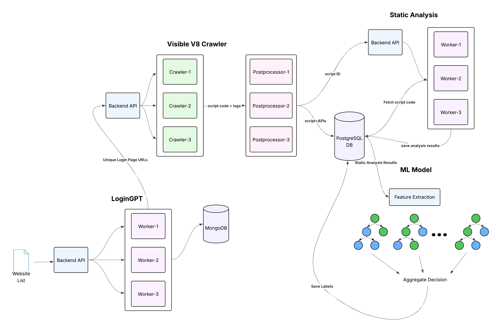

# VisibleV8 Crawler with LoginGPT Integration

<p align="center"></p>

The VisibleV8 Crawler is an enhanced framework for large-scale crawling of URLs with [VisibleV8](https://github.com/wspr-ncsu/visiblev8), integrated with [LoginGPT](https://github.com/aswad546/LoginGPT/tree/main) and Behavioral Biometric Static Analysis ([BBSA](https://github.com/aswad546/BehavioralBiometricSA)) capabilities. This enhanced version is based on research from "Tracking for Good: Finding Behavioral Biometrics on the Web using Static Taint Analysis" thesis. Paper is submitted for publication pending review.

## Key Enhancements

- **LoginGPT Integration**: Advanced login page detection using Vision Language Models
- **BBSA Integration**: Behavioral Biometric Static Analysis for script classification
- **Action Replay**: Ability to replicate navigation actions to reach login pages
- **Observability Stack**: Complete monitoring with Loki, Prometheus, Jaeger, and Grafana
- **Cross-Domain Login Support**: Track login pages that may not be subdomains of the original domain

## System Architecture

This repository contains comprehensive observability infrastructure where:
- **BBSA Static Analysis** and **LoginGPT** send logs to Loki container for centralized logging
- **Prometheus** handles metrics collection from LoginGPT
- **Jaeger** displays LoginGPT traces for distributed tracing
- **Grafana** visualizes Prometheus metrics as dashboards

## Setup

> **Note**
> This tool requires Python 3.10 or above. If your OS python3 version is <3.10, you can use [`pyenv`](https://github.com/pyenv/pyenv) to setup a specific version of Python.

To setup VisibleV8 Crawler install `docker` and `docker-compose`, and run the following command

```sh
pip install -r ./scripts/requirements.txt
python ./scripts/vv8-cli.py setup
```

> **Warning**
> Make sure that you are able to use `docker` and `docker compose` without using sudo. ([instructions here](https://docs.docker.com/engine/install/linux-postinstall/))

If you plan to use visiblev8 crawler a lot, you can alias the script to the `vv8cli` command using:

```sh
alias vv8cli="python3 $(pwd)/scripts/vv8-cli.py" 
```

> **Note**
> vv8 crawler cli scripts can also be used for a shared remote server by choosing the remote installation option during the setup wizard. The list of URLs (and their submission IDs) that have been run by you (and their associated submission ids) are stored locally in a sqlite3 database at `./scripts/.vv8.db`

### Post-Processor Setup

Activate the enhanced post-processor:

```sh
docker cp artifacts/vv8-post-processor {POST_PROCESSOR_CONTAINER_ID}:/app/post-processors
```

## Network Configuration

The system operates across multiple ports and can be deployed on single or multiple machines:

- **Port 4050**: LoginGPT sends login pages to VisibleV8 crawler
- **Port 8100**: Individual JS scripts forwarded to BBSA system
- **Port 5434**: VV8 database access (required by BBSA system)
- **Port 3100**: Loki logging system
- **Prometheus & Jaeger**: See respective config files for port requirements

For multi-machine deployments, use SSH port forwarding to connect services across different hosts.

## Usage

### Start the FastAPI Listener

Activate the FastAPI endpoint that listens for login pages to crawl:

```sh
python ./scripts/vv8-cli.py crawl -sso
```

This starts a modified flow post-processor that stores submission URLs, enabling tracking of login pages across different domains (e.g., abc.com might have login pages on different subdomains or external domains).

### Send URLs for Crawling

The system accepts URLs via POST requests to the FastAPI endpoint. Use the following format:

```sh
#!/bin/bash
# send_single_url.sh - Example API usage

# Configuration
API_URL="http://127.0.0.1:4050/api/login_candidates"
TASK_ID="101"
URL="aswad546.github.io"
FULL_URL="https://${URL}"
SCAN_DOMAIN="${URL}"
ID_NUM=1

# Create the JSON payload
JSON_PAYLOAD=$(cat <<EOF
{
  "task_id": "${TASK_ID}",
  "candidates": [
    {
      "id": ${ID_NUM},
      "url": "${FULL_URL}",
      "actions": null,
      "scan_domain": "${SCAN_DOMAIN}"
    }
  ]
}
EOF
)

echo "Sending URL: ${FULL_URL}"
echo "Payload: ${JSON_PAYLOAD}"

# Send the request
response=$(curl -s -w "\n%{http_code}" \
  -X POST \
  -H "Content-Type: application/json" \
  -d "${JSON_PAYLOAD}" \
  "${API_URL}")

# Extract response body and status code
http_code=$(echo "$response" | tail -n1)
response_body=$(echo "$response" | head -n -1)

echo "HTTP Status Code: ${http_code}"
echo "Response: ${response_body}"

# Check if successful
if [ "$http_code" -eq 200 ]; then
    echo "✅ Successfully sent URL!"
else
    echo "❌ Failed to send URL. HTTP Status: ${http_code}"
    exit 1
fi
```

### Action Replay System

The system can replicate navigation actions to reach login pages from home pages:

- **With Actions**: Include a sequence of actions (clicks, form fills, etc.) in the `actions` field
- **Without Actions**: Set `actions` to `null` to crawl the URL directly

The crawler will replay the provided actions to navigate from the homepage to the target login page, enabling analysis of complex authentication flows.

## Database Integration

### Accessing the PostgreSQL Database

```sh
psql --host=0.0.0.0 --port=5434 --dbname=vv8_backend --username=vv8
```

> **Note**: Default password is `vv8`

### Linking Scripts to Submission URLs

To correlate scripts with their originating submission URLs:

```sql
SELECT s.url as submission_url, sf.script_url, sf.script_id
FROM submissions s
JOIN script_flow sf ON s.id = sf.submission_id
WHERE s.url = 'your_target_domain.com';
```

This query helps identify which domain each login page and associated scripts belong to, even when login pages are hosted on different domains.

## Monitoring and Observability

### Web Interface Monitoring

Access the Flower Web UI to monitor crawling and post-processing status:
```
http://localhost:5555
```

### Log Monitoring

View real-time crawler logs:
```sh
python3 ./scripts/vv8-cli.py docker -f
```

### Centralized Logging with Loki

All system components (BBSA, LoginGPT, VV8 Crawler) send structured logs to Loki at port 3100 for centralized log aggregation and search.

### Metrics and Tracing

- **Grafana Dashboards**: Visualize LoginGPT metrics and system performance
- **Jaeger Traces**: Monitor distributed request flows through LoginGPT
- **Prometheus Metrics**: Collect and aggregate performance metrics

## Advanced Features

### Fetch Crawl Metadata

Retrieve various artifacts generated during crawling:

```sh
# Get crawl status
python3 ./scripts/vv8-cli.py fetch status 'https://google.com'

# Download screenshots
python3 ./scripts/vv8-cli.py fetch screenshots 'https://google.com'

# Get raw logs
python3 ./scripts/vv8-cli.py fetch raw_logs 'https://google.com'

# Download HAR files
python3 ./scripts/vv8-cli.py fetch hars 'https://google.com'
```

### Post-Processor Integration

Apply behavioral biometric analysis during crawling:

```sh
# Apply specific post-processor
python3 ./scripts/vv8-cli.py crawl -u 'https://google.com' -pp 'Mfeatures'

# Chain multiple post-processors
python3 ./scripts/vv8-cli.py crawl -u 'https://google.com' -pp 'Mfeatures+adblock'
```

## Research Integration

This enhanced VisibleV8 Crawler is specifically designed for behavioral biometric research and includes:

- **Static Taint Analysis**: Automated detection of behavioral biometric scripts
- **LoginGPT Navigation**: AI-powered login page discovery and navigation
- **Cross-Domain Tracking**: Comprehensive tracking of authentication flows across domains
- **Observability Stack**: Full monitoring and analysis capabilities for research workflows

The system bridges the gap between automated web crawling and specialized behavioral biometric analysis, enabling large-scale studies of authentication technologies on the modern web.

## Port Forwarding for Multi-Machine Setup

For distributed deployments, use SSH port forwarding:

```sh
# Forward LoginGPT to VV8 Crawler
ssh -L 4050:localhost:4050 user@loginGPT-server

# Forward VV8 database to BBSA system
ssh -L 5434:localhost:5434 user@vv8-server

# Forward observability stack
ssh -L 3100:localhost:3100 user@logging-server
ssh -L 9090:localhost:9090 user@prometheus-server
ssh -L 16686:localhost:16686 user@jaeger-server
```

> **Note**
> If you are using the crawler in a SSH session, you can make use of [port-forwarding](https://help.ubuntu.com/community/SSH/OpenSSH/PortForwarding) to browse the web UI and access distributed services.
